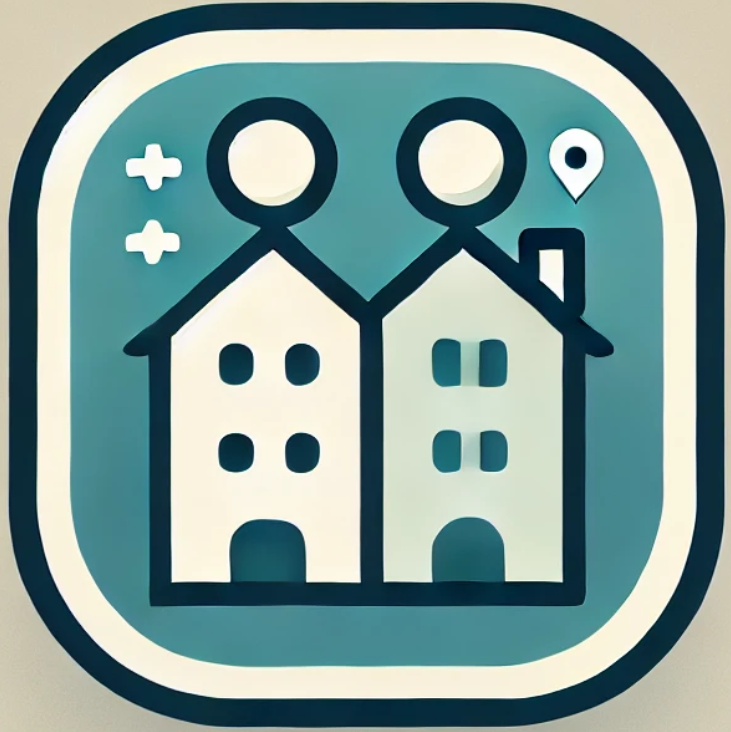

<a id="readme-alku"></a>
<!-- SHIELDIT -->
[![Contributors][contributors-shield]][contributors-url]
[![Issues][issues-shield]][issues-url]

<div align="center">

<h1><i>Kämppis</i></h1>
</div>

<br>
<details>
<summary><b>Sisällysluetto</b></summary>
  <ol>
    <li>
        <a href="#mikä-kämppis">Mikä <i>Kämppis</i>?</a>
    </li>
    <li>
        <a href="#teknologiat">Teknologiat</a>
    </li>
    <li>
        <a href="#cicd">CI/CD</a>
    </li>
    <li>
        <a href="#serverin-asennus">Serverin asennus</a>
    </li>
    <li>
        <a href="#ota-yhteyttä">Ota yhteyttä</a>
    </li>
  </ol>
</details><br>

## Mikä _Kämppis_?
_Kämppis_ on mobiilisovellus, joka yhdistää kämppiksiä etsivät ihmiset toistensa kanssa.

Kaikki projektin back-endin avoimet issuet sekä tunnetut bugit löydät täältä: <br>
[![Back-end issues][back-end-issues-logo]][back-end-issues-url]

Tämä repositorio sisältää sovelluksen back-endin. Mobiilisovelluksen repositorion löydät täältä:<br>
[![App repository][app-repository-logo]][app-repository-url]

Lisätietoa koko projektista löydät täältä: <br>
[![Project repository][project-repository-logo]][project-repository-url]

Projekti on toteutettu osana Haaga-Helia ammattikorkeakoulun [Ohjelmistoprojekti 2](https://opinto-opas.haaga-helia.fi/course_unit/SOF007AS3A) -opintojaksoa.

<p align="right">(<a href="#readme-alku">Takaisin alkuun</a>)</p>

## Teknologiat

_Kämppiksen_ back-end on rakennettu käyttämällä seuraavia teknologioita:

[![Kotlin][kotlin-logo]][kotlin-url]
[![Spring Boot][spring-logo]][spring-url]
[![Gradle][gradle-logo]][gradle-url]
[![PostgreSQL][postgres-logo]][postgres-url]
[![GitHub][github-logo]][github-url]
[![GitHub Actions][github-actions-logo]][github-actions-url]
[![Docker][docker-logo]][docker-url]
[![Bruno][bruno-logo]][bruno-url]
[![IntelliJ IDEA][intellij-idea-logo]][intellij-idea-url]

<p align="right">(<a href="#readme-alku">Takaisin alkuun</a>)</p>

## CI/CD

_Kämppiksen_ back-endissä on hyödynnetty jatkuvan integraation ja toimituksen prosessia GitHub Actionsin kautta. GitHub Actions määrittää automaatioputken, joka jokaisella `git push` -komennolla luo GitHubissa back-endille PostgreSQL-testitietokannan testidatasta ja ajaa back-endin yksikkö- ja integrointitestit käyttämällä testitietokantaa. Testien suorituksen jälkeen testitietokanta ajetaan alas.

Testiautomaatiolla voidaan varmistaa sovelluksen toimivuus jatkuvasti muutoksia tehdessä. Lisätietoja automaatiosta löydät [workflow](./.github/workflows/run-tests.yml)-tiedostosta

<p align="right">(<a href="#readme-alku">Takaisin alkuun</a>)</p>

## Serverin asennus

Serverin asennukseen tarvitset [Dockerin](https://www.docker.com).
1. Copy the repository from GitHub to your local machine
```bash
git clone https://github.com/HH-Nat20/kamppis-server.git
```
2. Move to the repository folder
```bash
cd kamppis-server
```
3. Start the container with docker compose
```bash
docker compose up
```
4. The server is up and running on localhost:8080. For example, try navigating to http://localhost:8080/api/users/ on your browser
5. Stop the container with ctrl + c, and pull down the containers
```bash
docker compose down
```
Valmis! Jee!

<p align="right">(<a href="#readme-alku">Takaisin alkuun</a>)</p>

## Ota yhteyttä
Sovelluksen ovat toteuttaneet
- Janne Airaksinen: [devaajanne](https://github.com/devaajanne)
- Paul Carlson: [Phoolis](https://github.com/Phoolis)
- Jesse Hellman: [Bminor87](https://github.com/Bminor87)
- Julia Hämäläinen: [marttyyriroskis](https://github.com/marttyyriroskis)

Kehittäjien yhteystiedot löydät GitHub-profiileista.
<p align="right">(<a href="#readme-alku">Takaisin alkuun</a>)</p>

<!-- LINKIT JA KUVAT -->

<!-- CONTRIBUTORS JA ISSUES -->
[contributors-shield]: https://img.shields.io/github/contributors/HH-Nat20/kamppis-server?style=for-the-badge
[contributors-url]: https://img.shields.io/github/contributors/HH-Nat20/kamppis-server
[issues-shield]: https://img.shields.io/github/issues/HH-Nat20/kamppis-server?style=for-the-badge
[issues-url]: https://img.shields.io/github/issues/HH-Nat20/kamppis-server

<!-- PROJEKTI JA REPOSITORIOT -->
[project-repository-logo]: https://img.shields.io/badge/Project%20Repository-000000?style=for-the-badge
[project-repository-url]: https://github.com/HH-Nat20
[app-repository-logo]: https://img.shields.io/badge/App%20Repository-000000?style=for-the-badge
[app-repository-url]: https://github.com/HH-Nat20/kamppis-app
[back-end-issues-logo]: https://img.shields.io/badge/BackEnd%20Issues-000000?style=for-the-badge
[back-end-issues-url]: https://github.com/HH-Nat20/kamppis-server/issues

<!-- TEKNOLOGIAT JA TYÖKALUT-->
[kotlin-logo]: https://img.shields.io/badge/Kotlin-7F52FF?style=for-the-badge&logo=Kotlin&logoColor=white
[kotlin-url]: https://kotlinlang.org/
[spring-logo]: https://img.shields.io/badge/Spring%20Boot-6DB33F?style=for-the-badge&logo=springboot&logoColor=white
[spring-url]: https://spring.io/
[gradle-logo]: https://img.shields.io/badge/Gradle-02303A?style=for-the-badge&logo=Gradle&logoColor=white
[gradle-url]: https://gradle.org/
[postgres-logo]: https://img.shields.io/badge/postgresql-4169e1?style=for-the-badge&logo=postgresql&logoColor=white
[postgres-url]: https://www.postgresql.org/
[github-logo]: https://img.shields.io/badge/GitHub-%23121011.svg?logo=github&logoColor=white&style=for-the-badge
[github-url]: https://github.com/
[github-actions-logo]: https://img.shields.io/badge/github%20actions-%232671E5.svg?style=for-the-badge&logo=githubactions&logoColor=white
[github-actions-url]: https://github.com/features/actions
[docker-logo]: https://img.shields.io/badge/docker-257bd6?style=for-the-badge&logo=docker&logoColor=white
[docker-url]: https://www.docker.com/
[bruno-logo]: https://img.shields.io/badge/Bruno-FF6C37?style=for-the-badge&logo=Bruno&logoColor=white
[bruno-url]: https://www.usebruno.com/
[intellij-idea-logo]: https://img.shields.io/badge/Intellij%20Idea-000?logo=intellij-idea&style=for-the-badge
[intellij-idea-url]: https://www.jetbrains.com/idea/